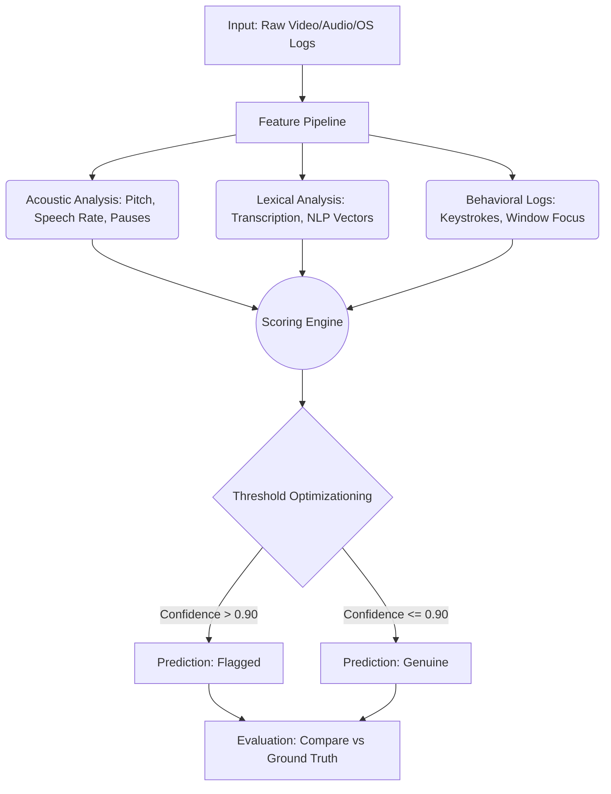

# AI Interview Integrity Analyzer: Evaluation & Testing Framework

This document outlines the systematic framework required to scientifically validate the AI Interview Integrity Analyzer. Following this structured approach ensures the system is reliable, minimizes false accusations, and is robust enough for production deployment and patent substantiation.

## 1. Dataset Creation

To accurately classify interview integrity, you need a controlled, diverse dataset representing all possible behaviors.

### Data Collection Strategy

*   **a) Genuine Responses (Natural Answers)**
    *   **Methodology:** Conduct unscripted mock interviews based on candidates' actual resumes. Ensure interviewers ask a mix of behavioral and technical block questions. 
    *   **Data Source:** Recorded video/audio from consent-given mock interviews.
*   **b) Memorized Responses (Rehearsed Answers)**
    *   **Methodology:** Provide candidates with a fully written script or complex technical answer 24-48 hours in advance. Instruct them to memorize and recite it verbatim during the interview.
    *   **Data Source:** Actors or internal volunteers.
*   **c) AI-Assisted Responses (ChatGPT/LLM)**
    *   **Methodology:** Instruct candidates to use a secondary device or an off-screen LLM window during the interview to generate and read out answers live. Incorporate natural delays (typing, reading comprehension).
    *   **Data Source:** Internal volunteers explicitly instructed to "cheat" using specific tools.

> [!IMPORTANT]
> **Primary Source of Truth (Ground Truth):** Your labels must be derived from the *collection method* (e.g., you explicitly told Candidate A to use ChatGPT), **not** post-interview human guessing, as humans are notoriously bad at detecting AI assistance.

### Structure & Sizing
*   **Minimum Size:** 1,500 individual response clips (30-90 seconds each) to form a statistically significant baseline.
*   **Distribution:** 
    *   40% Genuine (600 clips)
    *   30% Memorized (450 clips)
    *   30% AI-Assisted (450 clips)
*   **Metadata:** Each entry must contain `[candidate_id, video_path, audio_path, true_label, question_type, native_language]`.

---

## 2. Labeling Strategy

### Ensuring Quality and Consistency
1.  **Strict Methodological Labeling:** Assign labels strictly based on instructions given to the participant prior to recording.
2.  **Cross-Validation via Blind Annotators:** Send a fully randomized 10% subset (150 clips) to independent human reviewers. Have them label the clips as Genuine/Memorized/AI. 
    *   *Purpose:* Evaluate human baseline accuracy compared to the AI system.
3.  **Ambiguity Flagging:** Any clip where technical glitches occurred or the candidate failed to follow instructions must be dropped from the primary training/testing set to prevent noisy labels.

---

## 3. Feature Extraction Validation

Before trusting the final model output, you must validate that the independent mathematical features are being measured correctly.

| Feature Area | Validation Method | Acceptance Criteria |
| :--- | :--- | :--- |
| **Speech Rate (WPM/SPM)** | Use established baselines (e.g., `Praat` software) on a 50-clip subset and compare manual syllable counts to system output. | < 5% variance from manual count. |
| **Pause Frequency/Length** | Manually identify speech boundaries on a waveform timeline and compare to the system's VAD (Voice Activity Detection). | Accurately catches >95% of pauses > 500ms. |
| **Textual / Lexical Features** | Run known memorized scripts through similarity checks (Cosine Similarity via Sentence-BERT). | Similarity scores tightly group > 0.85. |
| **Keystroke / OS Events** | Run automated macros to inject keystrokes/mouse clicks during a dummy run. | 100% exact match of injected events. |

---

## 4. Model Evaluation

Choosing the right metrics is critical. In integrity analysis, **the cost of a false positive (accusing an honest candidate) is catastrophically higher than a false negative (missing a cheater).**

### Key Metrics
*   **Accuracy:** Overall correctness: `(TP + TN) / Total`.
    *   *Use case:* General health check, but can be misleading in imbalanced datasets.
*   **Precision (Crucial):** `TP / (TP + FP)` - Out of all candidates flagged as "AI-Assisted", how many were actually using AI? 
    *   *Use case:* Primary optimization target. You want this > 98%.
*   **Recall:** `TP / (TP + FN)` - Out of all true cheaters, how many did the system catch?
    *   *Use case:* Secondary optimization. Lower recall implies some cheaters get away, which is acceptable if it protects honest candidates.
*   **F1-Score:** Harmonic mean of Precision and Recall.
*   **False Positive Rate (FPR):** `FP / (FP + TN)` - Percentage of honest candidates falsely accused. **Must explicitly push this below 1%.**

> [!CAUTION]
> Calibrate your model's prediction thresholds (e.g., requiring a 90% confidence score to output 'AI-Assisted') specifically to suppress the FPR, even if it hurts overall accuracy.

---

## 5. Testing Pipeline

Implement this continuous integration pipeline for the analyzer:

---

## 6. Real-World Simulation

Testing in an aseptic lab environment is not enough. You must simulate the chaos of real networking and human anxiety.

1.  **A/B Shadow Mode:** Deploy the system in actual introductory interviews but set it strictly to **"Shadow Mode"** (predictions are logged but hidden from interviewers and make no decisions). 
2.  **Adversarial "Red Teaming":** Hire technically proficient students/freelancers. Offer them a financial bounty if they can successfully use an LLM or script to answer questions without triggering the analyzer. Analyze their bypass methods to patch system vulnerabilities.
3.  **Human vs. AI Parity Test:** Calculate the correlation matrix between human interviewer suspicion (via post-interview survey) and AI analyzer scores.

---

## 7. Output & Reporting

### Sample Evaluation Report Overview

When presenting your findings to stakeholders or in a patent application, structure results clearly.

#### Example Confusion Matrix (Dataset size: 300 test cases)

| True Label \ Predicted --> | Genuine | Memorized | AI-Assisted |
| :--- | :--- | :--- | :--- |
| **Genuine (100)** | **99** | 1 | 0 |
| **Memorized (100)** | 15 | **82** | 3 |
| **AI-Assisted (100)** | 12 | 2 | **86** |

**Interpretation of Matrix:**
*   *False Accusations:* Only 1 honest candidate was falsely flagged as 'Memorized', and 0 as 'AI'. (FPR = 1%). Excellent safety profile.
*   *Missed Cheaters:* 27 cheating candidates (15 + 12) managed to pass as 'Genuine' (False Negatives). Acceptable trade-off to ensure fairness.

### Iterative Improvement Loop
1.  **Isolate False Positives:** Manually review any false positives. Did background noise skew the speech rate? Did a heavy accent throw off the pause-detection?
2.  **Adjust Weights:** If Lexical analysis triggers false positives for highly articulate candidates, reduce the weight of vocabulary density in the final scoring ensemble.
3.  **Re-Run Pipeline:** Automate the pipeline so any threshold tweak instantly recalculates the Confusion Matrix and Precision/Recall scores across the entire dataset.
